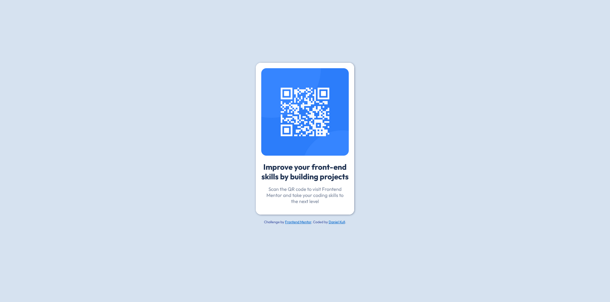

# Frontend Mentor - QR code component solution

This is a solution to the [QR code component challenge on Frontend Mentor](https://www.frontendmentor.io/challenges/qr-code-component-iux_sIO_H). Frontend Mentor challenges help you improve your coding skills by building realistic projects.

## Table of contents

- [Overview](#overview)
  - [Screenshot](#screenshot)
  - [Links](#links)
- [My process](#my-process)
  - [Built with](#built-with)
- [Author](#author)
- [Acknowledgments](#acknowledgments)

## Overview

My solution of the QR code compontent challenge on Frontend Mentor

### Screenshot

### Links

- Solution URL: [GitHub repository](https://github.com/danielkull/FrontM-qr-code-component)
- Live Site URL: [Live site from GitHub](https://danielkull.github.io/FrontM-qr-code-component/)

## My process

### Built with

- Semantic HTML5 markup
- CSS custom properties
- CSS Grid

## Author

- Website - [Daniel Kull]
- Frontend Mentor - [@danielkull](https://www.frontendmentor.io/profile/danielkull)

## Acknowledgments

My thanks goes to the Coding-bootcamps-eu, it's teachers and fellow students.
And I also want to thank Frontend Mentor for the provision of these challenges. With which everybody get the opportunity to practice there skills.
